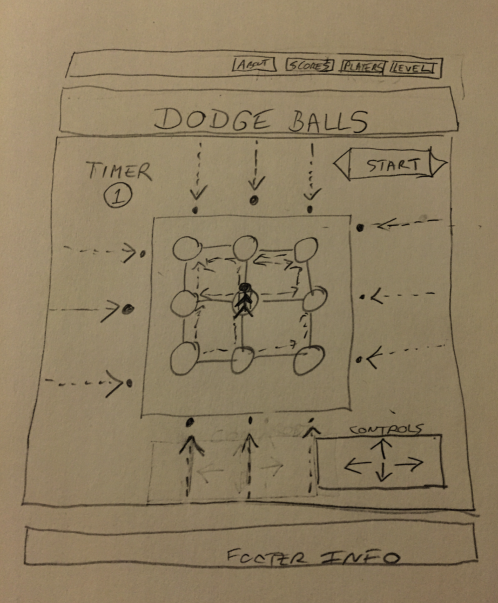

#Project 1 - Dodge Balls

###Developed by Gaye Lowenstein 10/06/16
###

_Objective_

The objective of the game is to move around and avoid getting hit by the incoming ball for as long as possible.  

* Move block to avoid getting hit by incoming ball.
* Win by outlasting the timer.
* Lose by getting hit before time ends.

_Installation Instructions_

1. Go to my github at https://github.com/glowen18/glowen18
2. Clone the repository.
3. Open the index.html in the browser.
4. Enjoy!  

_Links_

* Trello Link: https://trello.com/b/EaXbehpk/project-1-dodge-balls
* Dodge Ball Link: https://glowen18.github.io/glowen18/

_Technologies Used_

* HTML
* CSS
* Javascript
* jQuery
* CANVAS

_Approach To Building Game_  

1. Started by creating separate HTML, CSS & JS files.
2. In the HTML files did the following:

* Setup basic HTML

* Load game
* Start game
* Reset game
* End game
* Move player around the board
* Shoot balls out from each side of the board
* Congratulate the winner
* Condolences to the loser

3. Created Win Logic using conditional statements.

4. Created Reset button to start a new game.

_Wireframe_  

